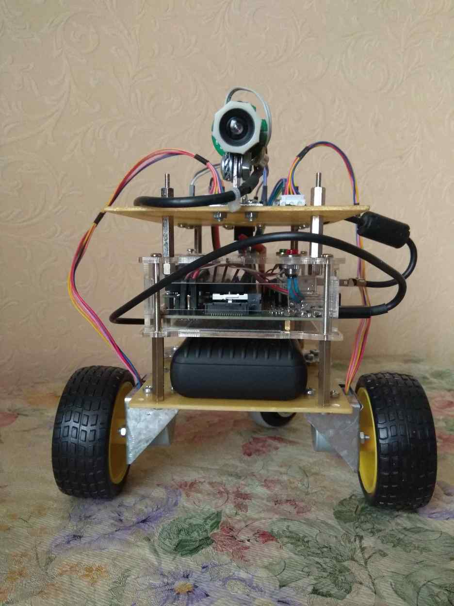
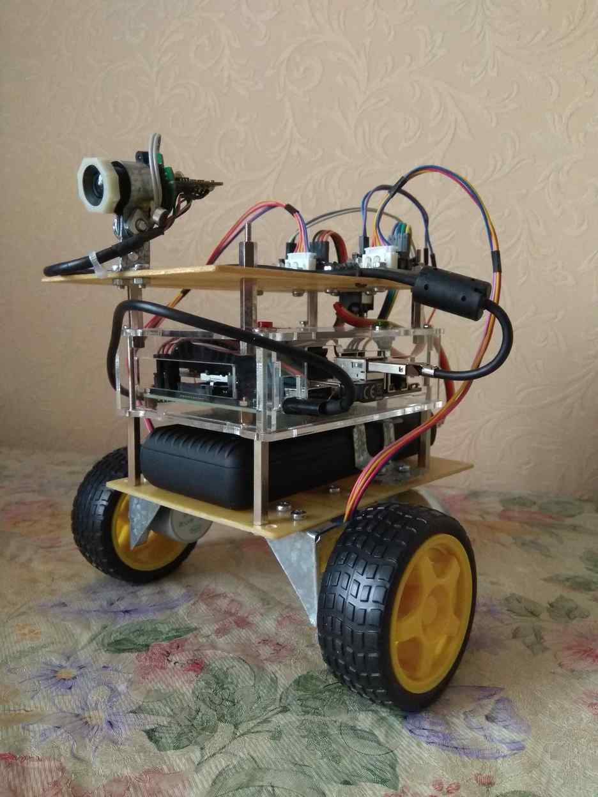
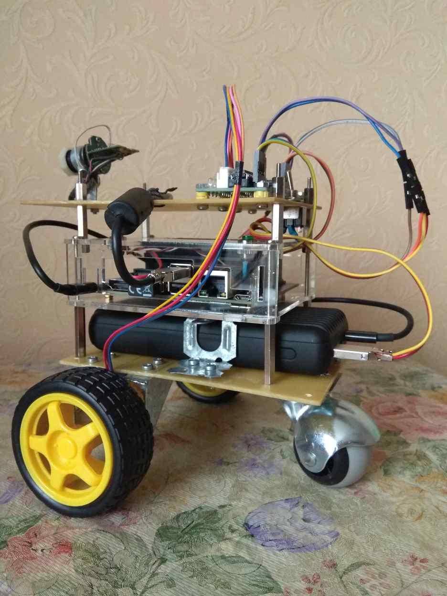

# rosbot

  

This is the implementation of a robotic platform with monocular SLAM navigation. The main aim of this work is to improve feature matching algorithms used for camera positioning in a SLAM pipeline. The recent experiments are about using deep learning for SLAM, especially using the [Local Feature Matching with Transformers](https://github.com/Kolkir/Coarse_LoFTR_TRT) for camera positioning.

Differential wheeled robot platform is based on the following hardware:

1. NVIDIA Jetson Nano 2Gb
2. Two 28BYJ-48 Stepper Motors with ULN2003 Drivers
3. One usb-camera
4. Powerbank

And as a software platform I use ROS.

SLAM example:

