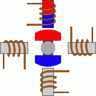
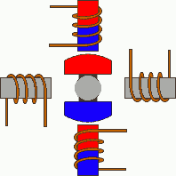
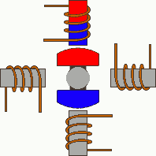

# The  28BYJ-48 stepper motor.

The 28BYJ-48 is a 5-wire unipolar stepper motor that runs on 5 volts. 

Unipolar stepper motors require only one power source because the two electromagnets have a common wire. The common wire is usually connected to ground. 

They usually come with a ULN2003 based driver board which makes them super easy to use.

# Specifications
~~~
Rated voltage	5 V
Coil Resistance	50 Ohms
Coil Type	Unipolar
Diameter – shaft	0.197″ (5.00 mm)
Length – shaft and bearing	0.394″ (10 mm)
Features	Flatted shaft
Size/dimension	Round – 1.100″ dia (28.00 mm)
Mounting hole spacing	Flatted Shaft
Gear reduction	1/64 (see note)
Step angle	Half step mode (recommended): 0.0879°
Full step mode: 0.176°
Steps per revolution	Half step mode: 4096 (see note)
Full step mode: 2048
Termination style	Wire leads with connector
Motor type	Permanent Magnet Gear Motor
Number of phases	4
~~~

These stepper motors use a cogged wheel (having 32 teeth) and four electromagnets to rotate the wheel one `step` at a time.

Each HIGH pulse sent, energizes the coil, attracts the nearest teeth of the cogged wheel and drives the motor one step.

The way you pulse these coils greatly affects the behavior of the motor:

1. The sequence of pulses determines the spinning direction of the motor.
2. The frequency of the pulses determines the speed of the motor.
3. The number of pulses determines how far the motor will turn.

According to the data sheet, when the 28BYJ-48 motor runs in full step mode, each step corresponds to a rotation of 11.25°. 

That means there are 32 steps per revolution (360°/11.25° = 32).

In addition, the motor has a 1/64 reduction gear set. (Actually its 1/63.68395 but for most purposes 1/64 is a good enough approximation)

It means that it has approximately 4076 steps per full revolution in half step mode and 2038 in full step mode.

# Making a Stepper Motor Rotate

Rotating a stepper motor is often called driving and can be a wave drive, full-step drive, half-step drive or microstep. The last one is complicated and less common so it will not be discussed here.

In a wave drive, one electromagnet or coil is excited at a time:



In a full-step drive, two coils are excited at a time:



Since the full-step drive energizes two coils at a time, it requires more current than a wave step. In exchange of the higher current is higher torque.

A half-step combines a wave and a full-step:



Half-step increases the number of steps per revolution. As you can see in the wave and full-step drives, one revolution takes four steps. In a half-step drive, one revolution takes eight steps. Thus, a half-step drive is recommended for a more precise movements.

# Motor rotation code idea

Half-step mode one revolution cycle:

```python
control_pins = [15, 19, 21, 23]
halfstep_seq = [
            [1, 0, 0, 0],
            [1, 1, 0, 0],
            [0, 1, 0, 0],
            [0, 1, 1, 0],
            [0, 0, 1, 0],
            [0, 0, 1, 1],
            [0, 0, 0, 1],
            [1, 0, 0, 1]
               ]

for _ in range(4076):
  for halfstep in range(8):
    for pin in range(4):
      GPIO.output(control_pins[pin], halfstep_seq[halfstep][pin])
```

# Sources:
1. https://lastminuteengineers.com/28byj48-stepper-motor-arduino-tutorial/
2. https://www.teachmemicro.com/control-28byj-48-stepper-motor-arduino/
